# Complete Upgrid build in GitHub Actions

Workflow: `.github/workflows/chromium-full.yml`, branch
`codex/chromium-distributed`. No Windows disk, WSL process or self-hosted
runner is used. The older distributed/local workflow is independent.

## Run

```sh
gh workflow run chromium-full.yml --repo NirvanaEx/android-browser \
  --ref codex/chromium-distributed -f mode=build -f cache_tag=auto -f shards=40
```

`mode=validate` only runs the tooling tests. Pushes to CI sources also run
validation without starting another full Chromium build.

`mode=android-test` runs a signed APK in a GitHub-hosted Android emulator.
Pass `build_tag=upgrid-ci-RUN-ATTEMPT`, or `baseline` to check the previous
signed APK used for update tests. The test job also follows successful builds.
It verifies the APK digest, installs the previous version, stores test data,
updates without clearing data, exercises native player controls and saves
screenshots, page state and logcat in an Actions artifact. ARM64 runs through
the Google APIs image's native translation on an x86_64 emulator. This is
Android functional evidence, not physical-device codec/performance/DRM proof.
The test entry point refuses execution outside GitHub Actions. Test VMs are
disposable and never use the user's PC as a runner.

The workflow is serialized per branch. Forty shards can run concurrently
subject to the account's actual GitHub concurrency quota (20 was observed).
Each worker runs four compiler processes. Preparation and final assembly
each use one four-vCPU runner; separate VMs do not pool their RAM for linking.
No paid larger runner is selected. Allocation is not measured peak usage.

```mermaid
flowchart LR
  A[Validate tooling] --> B[Restore cache or fetch pinned Chromium]
  B --> C[Generate native dependencies]
  C --> D[40 balanced C++ shards]
  D --> E[Parallel verify and import on final runner]
  E --> F[Java, Rust, linking, signed APK]
  F --> G[APK identity and SHA checks]
  G --> H[APK and next-build cache in GitHub]
  H --> I[Real Android acceptance]
  I --> J[Accepted GitHub release and Telegram verification]
```



## Incremental builds and storage

`cache_tag=auto` selects a completed cache with the same pinned Chromium
revision and absolute workspace root. An explicit `upgrid-ci-RUN-ATTEMPT`
selects a specific cache. An empty value requests a cold checkout.
The source overlay and version arguments are applied, GN is regenerated,
and Ninja decides what changed. No dependency timestamp is artificially
advanced to suppress a legitimate rebuild.

If no completed cache is available, `auto` can restore a compatible immutable
prepared workspace from an earlier interrupted run. This is only a source
seed; it does not count as a successful compilation, and all changed build
inputs still invalidate outputs normally.

Preparation generates reachable native headers and Clang modules before
sharding. Import checks the run, source SHA, snapshot SHA, every object,
and all compiler inputs. Four threads unpack/hash/copy; a single writer
merges the Ninja dependency and command logs. Missing or changed inputs
fail before output files are replaced.

Complete workspaces are compressed with zstd into immutable chunks below
the GitHub Release per-file limit. Manifests carry SHA-256 and original
nanosecond mtimes are preserved. Inputs, intermediate objects, unaccepted
APK and caches are kept in **draft** releases, requiring repository write
access to download. These are build transfers, not published app releases.
Large APKs/caches do not consume Actions artifact storage; only small
diagnostic receipts use short-lived Actions artifacts. At least 20 GiB
free is reserved; restoration checks both archive and expanded size.

The cache manifest is uploaded last, so an interrupted cache upload cannot
be selected as complete. Cache tags are reported in the workflow summary.
Caches are not deleted automatically. Owners can remove obsolete draft
transfer releases after confirming they are not referenced by an active run.

## APK identity and release

Change `release.json` for each distributable version. The workflow rewrites
the GN arguments only inside its disposable checkout; local builds are
untouched. It checks APK ZIP integrity, package, version name/code, ABI,
signing certificate, SHA-256 and the fresh build receipt.

`release.json.profile` selects `extensions-ci` (optimized C++ and Java) or
`extensions-dev` (debug). Both use the CI-owned `out/Upgrid` directory; GN/Ninja
must invalidate incompatible cached outputs when changing profile. The optimized
profile is restricted to GitHub Actions and keeps the configured signing identity.
An optimized APK is still a test candidate, not production acceptance or a promise
of an in-place update from the older Fenix package. Installation/data preservation
remain explicit acceptance checks. `apk-size.json` records the signed candidate's
size by ZIP category, largest entries and ABI list without repacking it.
The current pinned security base is marked `productionApproved=false`.

After testing the exact APK on Android, commit
`tools/chromium/ci/acceptance/<APK-SHA256>.json` with:

- `buildTag`: the draft transfer tag;
- `sha256`, `package`, `versionName`, `versionCode`, `signerSha256`,
  `headSha`, `chromiumRevision`: exact values from `apk-verification.json`;
- `testedAtUtc`, `device`, `distributionApproved: true`;
- `checks`: each name from `acceptance.REQUIRED`, with `status: passed`
  and a concrete `evidence` path or test receipt reference.

Do not fabricate this receipt. Playback needs a real video frame and
lifecycle checks; translation needs actual translation, restart and
exceptions. An approved security base must match the APK revision.

The acceptance commit triggers `.github/workflows/chromium-publish.yml`.
It can also be invoked manually with `build_tag`. The publisher validates
the receipt, checks the restricted server adapter, publishes the accepted
GitHub release and calls the existing VPS relay. The server checks the
repository receipt again, backs up SQLite with WAL awareness, uses relay
deduplication and verifies the catalogue, file access and fresh Telegram
poll with `verify_release.py`. Success requires a confirmed `message_id`.

One-time setup is `python tools/chromium/ci/install_relay.py` on the trusted
administrator machine with SSH alias `vps` and `gh` authentication. It
installs `relay_adapter.py` and `acceptance.py` under
`/root/projects/apk-relay/upgrid-ci/`, provisions a dedicated forced-command
key and the secrets `UPGRID_RELAY_SSH_KEY`, `UPGRID_RELAY_KNOWN_HOSTS`.
The bot token stays on the VPS. This adapter adds no cron or second poller.
Its `selfcheck` sends no Telegram messages.

## Failures and resumption

- Shards retain completed object archives even when a compiler fails.
  A failed shard prevents APK assembly. Re-run failed jobs at the same
  workflow revision; successful shard outputs remain usable.
- The final runner rejects other runs/revisions and verifies all inputs.
  Re-running only the final job restores the immutable prepared workspace.
- A failed final-stage upload can leave immutable APK assets in the draft;
  inspect those assets before retrying rather than overwriting them.
- An uncertain Telegram send stops with a durable server journal. Inspect
  the existing receipt/delivery; never force a blind resend.
- A green tooling test or native matrix is not proof of a completed APK.
  The final APK verification receipt is the compilation result; Android
  acceptance and Telegram delivery are separate results.

## Tests

```sh
python3 -m unittest discover -s tools/chromium/ci/tests -v
UPGRID_TEST_NINJA=ninja python3 tools/chromium/distributed/test_cache.py
```

Tests use real Ninja to verify cache acceptance and header invalidation,
reject changed/corrupt/incomplete inputs before mutation, round-trip split
zstd archives with exact mtimes/symlinks, and enforce every acceptance gate.
